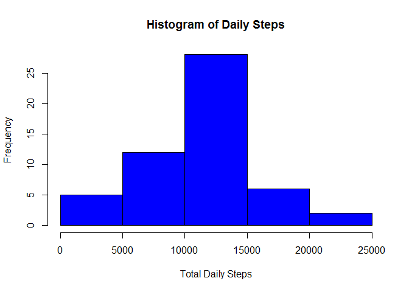
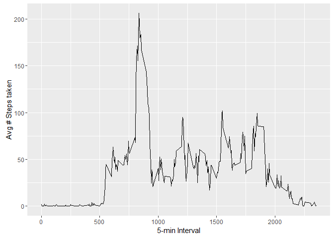
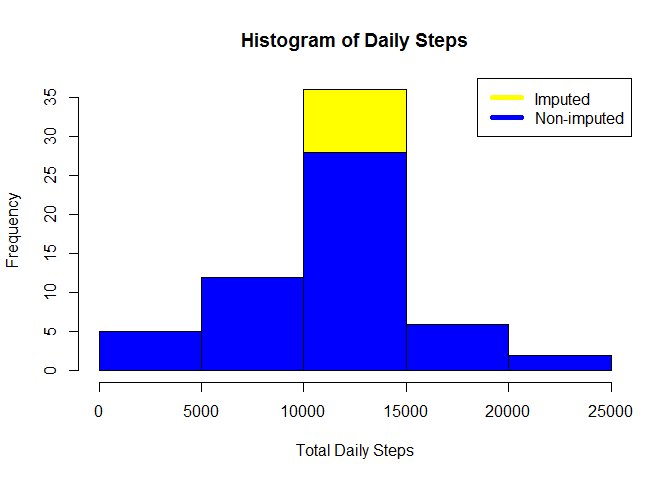
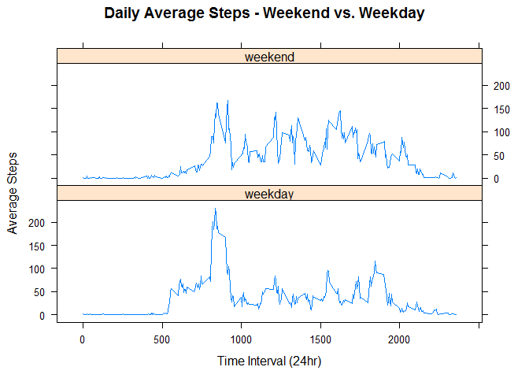

# Course 5 - Week 2 Assignment
Cole Owens  
March 2017  

Starting code (standards, libraries)

```r
knitr::opts_chunk$set(echo = TRUE)
library(stringr)
```

```
## Warning: package 'stringr' was built under R version 3.3.1
```

```r
library(tidyr)
library(dplyr)
```

```
## 
## Attaching package: 'dplyr'
```

```
## The following objects are masked from 'package:stats':
## 
##     filter, lag
```

```
## The following objects are masked from 'package:base':
## 
##     intersect, setdiff, setequal, union
```

```r
library(ggplot2)
library(lattice)
```


## A) Loading and Transforming the Data
In this section we are going to:  

1. Load the activity.csv file (act)  
2. Convert the date to date format (act2)
3. Remove N/A values (actrm)  


```r
act <- read.csv("C:/Users/HAL/Dropbox/Coursera/Course 5/Week2Assignment/activity.csv")
act2 <- act
act2$Time <- str_pad(act2$interval, 4, pad = "0")
act2$DateTime <- paste(act2$date,act2$Time, sep = "-")
act2$Date <- as.Date(act2$date, "%Y-%m-%d")
actrm <- act2[complete.cases(act2),]
act2$DT <- strptime(act2$DateTime, "%Y-%m-%d-%H%M")
actrm$DT <- strptime(actrm$DateTime, "%Y-%m-%d-%H%M")
```

## B) What is mean total number of steps taken per day?
For this part of the assignment, you can ignore the missing values in the dataset.

### B1) Calculate the total number of steps taken per day


```r
## find the daily sum of steps
sumDay <- with(actrm, tapply(steps, Date, sum, na.rm=T))
#sumDay2 <- data.frame(Date = as.Date(colnames(sumDay,"%Y-%m-%d")),sumDay)

print(sumDay)
```

```
## 2012-10-02 2012-10-03 2012-10-04 2012-10-05 2012-10-06 2012-10-07 
##        126      11352      12116      13294      15420      11015 
## 2012-10-09 2012-10-10 2012-10-11 2012-10-12 2012-10-13 2012-10-14 
##      12811       9900      10304      17382      12426      15098 
## 2012-10-15 2012-10-16 2012-10-17 2012-10-18 2012-10-19 2012-10-20 
##      10139      15084      13452      10056      11829      10395 
## 2012-10-21 2012-10-22 2012-10-23 2012-10-24 2012-10-25 2012-10-26 
##       8821      13460       8918       8355       2492       6778 
## 2012-10-27 2012-10-28 2012-10-29 2012-10-30 2012-10-31 2012-11-02 
##      10119      11458       5018       9819      15414      10600 
## 2012-11-03 2012-11-05 2012-11-06 2012-11-07 2012-11-08 2012-11-11 
##      10571      10439       8334      12883       3219      12608 
## 2012-11-12 2012-11-13 2012-11-15 2012-11-16 2012-11-17 2012-11-18 
##      10765       7336         41       5441      14339      15110 
## 2012-11-19 2012-11-20 2012-11-21 2012-11-22 2012-11-23 2012-11-24 
##       8841       4472      12787      20427      21194      14478 
## 2012-11-25 2012-11-26 2012-11-27 2012-11-28 2012-11-29 
##      11834      11162      13646      10183       7047
```

### B2) If you do not understand the difference between a histogram and a barplot, research the difference between them. Make a histogram of the total number of steps taken each day


```r
# Create histogram of sumDay
hist(sumDay,
     main = "Histogram of Daily Steps",
     ylab = "Frequency",
     xlab = "Total Daily Steps", 
     col = "blue")
```

<!-- -->

### B3) Calculate and report the mean and median of the total number of steps taken per day


```r
meanDay <- mean(sumDay, na.rm = T) 
medDay <- median(sumDay, na.rm = T)
```

The average number of steps: 1.0766189\times 10^{4}  
The median number of steps: 10765 

## C) What is the average daily activity pattern?

### C1) Make a time series plot (i.e. type = "l") of the 5-minute interval (x-axis) and the average number of steps taken, averaged across all days (y-axis)


```r
# Create a dataframe with the 5-min interval average # of steps
IntSteps <- aggregate(steps ~ interval, data = actrm, FUN = mean, na.rm = T)
```

```r
# Plot the averages you just calculated
ggplot(data=IntSteps, aes(x=interval, y=steps)) +
    geom_line() +
    xlab("5-min Interval") +
    ylab("Avg # Steps taken")
```

<!-- -->

### C2) Which 5-minute interval, on average across all the days in the dataset, contains the maximum number of steps?


```r
maxIntStep <- IntSteps[which.max(IntSteps$steps),]
print(maxIntStep)
```

```
##     interval    steps
## 104      835 206.1698
```

## D) Imputing missing values

Note that there are a number of days/intervals where there are missing values (coded as NA). The presence of missing days may introduce bias into some calculations or summaries of the data.

### D1) Calculate and report the total number of missing values in the dataset (i.e. the total number of rows with NAs)


```r
NumNA <- sum(!complete.cases(act2$steps))
```

There are **2304** NAs in the original dataset.

### D2) Devise a strategy for filling in all of the missing values in the dataset. The strategy does not need to be sophisticated. For example, you could use the mean/median for that day, or the mean for that 5-minute interval, etc.

I choose to use the mean # of step from the 5-min interval calculated in step C1 (IntSteps)

### D3) Create a new dataset that is equal to the original dataset but with the missing data filled in.


```r
## Create a new dataset
act3 <- act2

## replace the NA values
act3$steps[is.na(act3$steps)] <- as.integer(IntSteps$steps[match(act3$interval, IntSteps$interval)])
```

```
## Warning in act3$steps[is.na(act3$steps)] <- as.integer(IntSteps
## $steps[match(act3$interval, : number of items to replace is not a multiple
## of replacement length
```

```r
## check # NAs
NumNA3 <- sum(!complete.cases(act3$steps))
print (NumNA3)
```

```
## [1] 0
```

### D4) Make a histogram of the total number of steps taken each day and Calculate and report the mean and median total number of steps taken per day. Do these values differ from the estimates from the first part of the assignment? What is the impact of imputing missing data on the estimates of the total daily number of steps?


```r
# Find the daily sum of your new data frame
sumDay3 <- with(act3, tapply(steps, Date, sum, na.rm=T))
```

```r
# Create a histogram of the new data frame, layer the first histogram on top
hist(sumDay3,
     main = "Histogram of Daily Steps",
     ylab = "Frequency",
     xlab = "Total Daily Steps",
     col = "yellow")
hist(sumDay,
     main = "Histogram of Daily Steps",
     ylab = "Frequency",
     xlab = "Total Daily Steps", 
     col = "blue",
     add = T)
legend("topright", c("Imputed", "Non-imputed"), col=c("yellow", "blue"), lwd=5)
```

<!-- -->

```r
## calculate the mean/median of the new data
meanDay3 <- mean(sumDay3,na.rm = T)
medDay3 <- median(sumDay3, na.rm = T)

# calculate the difference in the means and medians
diffMean <- meanDay3 - meanDay
diffMed <- medDay3 - medDay
```

The average number of steps: 1.074977\times 10^{4}   
The median number of steps: 10641

Difference between Means:  1.074977\times 10^{4} - 1.0766189\times 10^{4} = -16.4181874   
Difference between Medians: 10641 - 10765 = -124

## E) Are there differences in activity patterns between weekdays and weekends?

For this part the **weekdays()** function may be of some help here. Use the dataset with the filled-in missing values for this part.

### E1) Create a new factor variable in the dataset with two levels - "weekday" and "weekend" indicating whether a given date is a weekday or weekend day.


```r
## use act3 to create a new dataset
act4 <- act3

## add a column to indicate if the date is a Weekday or Weekend
act4$EndOrDay <- ifelse((weekdays(as.Date(act4$date)) %in% c("Saturday", "Sunday")), "weekend","weekday")
```

### E2) Make a panel plot containing a time series plot (i.e. type = "l") of the 5-minute interval (x-axis) and the average number of steps taken, averaged across all weekday days or weekend days (y-axis). See the README file in the GitHub repository to see an example of what this plot should look like using simulated data.


```r
## Aggregate with relation to interval and weekend/weekday
sumInt4 <- aggregate(act4$steps, list(Interval = act4$interval, EndOrDay = act4$EndOrDay), mean, na.rm = T)
```

```r
## Plot the comparison of average steps on Weekends vs Weekdays
xyplot(x ~ Interval | EndOrDay,
       layout = c(1,2),
       data = sumInt4,
       type = "l",
       xlab = "Time Interval (24hr)",
       ylab = "Average Steps",
       main = "Daily Average Steps - Weekend vs. Weekday")
```

<!-- -->


Fin.
